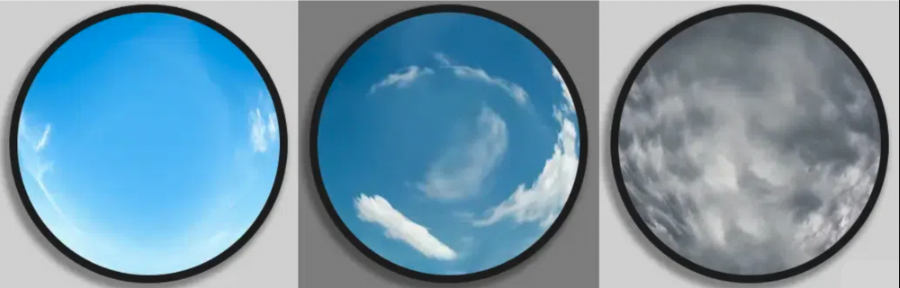

# Cloud Coverage Detection (CCD)



*Increasing Cloud Cover Percentage (from left to right)*

**[AIMS]** Predictive models for cloud coverage prediction (LSTM, GRU, Transformers)

**Team KVH:** Kanishk Jain, Vishrut Grover, Hemang Jain

---

## Problem Statement

Clouds play a crucial role in climate forecasting. However, projecting future cloud fractional cover—the percentage of the sky covered by clouds—carries significant uncertainty, making the task of creating trustworthy climate projections more difficult.

**Task:** Build predictive models for cloud coverage prediction after the next **15, 25, and 30 minutes**, given the data of the past **360 minutes (6 hours)**.

---

## Approach

We implemented various multivariate time series forecasting models to predict cloud cover percentage from numerical data. Training uses input sequences of **90 minutes (1.5 hours)**, with predictions for the 15th, 25th, and 30th minute ahead.

---

## Data Preprocessing

- **Datetime handling:** Converted non-standard date formats (e.g., `01-Jan`, `Jan-01`) into consistent datetime format
- **Feature scaling:** Scaled each feature individually to preserve relative importance and variance
- **Feature removal:** Dropped Snow Depth and Albedo (CMP11) as irrelevant
- **Feature engineering:**
  - **Temperature-Humidity Index (THI):** Combined Tower Dry Bulb Temp [deg C] and Tower Dew Point Temp [deg C]
  - **Potential Temperature:** Combined Tower Dry Bulb Temp [deg C] and Station Pressure [mBar]
  - **Wind components:** Replaced Peak Wind Speed @ 6ft and Avg Wind Direction @ 6ft with wind X and Y components
  - **Azimuth:** Replaced Azimuth Angle [degrees] with its Sine and Cosine
- **Missing values:** Used interpolation instead of dropping NaN values

---

## Models Implemented

| # | Model | Description |
|---|-------|-------------|
| 1 | **Simple RNN** | Recurrent Neural Network with dropout and dense output |
| 2 | **GRU** | Gated Recurrent Unit with stacked layers |
| 3 | **LSTM** | Long Short-Term Memory with return_sequences |
| 4 | **Custom LSTM** | LSTM with concatenated layers (combines features from multiple LSTM layers) |
| 5 | **Autoencoder** | Encoder-decoder with RepeatVector and TimeDistributed layers |
| 6 | **Transformer** | Custom Transformer with 2 encoder blocks, multi-head attention, positional embedding |
| 7 | **Conv1D + LSTM** | Combines 1D convolutions for local patterns with LSTM for temporal dependencies |

---

## Results

**Weighted Metric** = 0.5 × (metric @ 15 min) + 0.35 × (metric @ 25 min) + 0.15 × (metric @ 30 min)

| Model | Parameters | Weighted MAE | Weighted R² | Weighted MSE |
|-------|------------|--------------|-------------|--------------|
| Simple RNN | 11,251 | 3.710 | 0.900 | 70.3 |
| LSTM | 147,715 | 4.055 | 0.902 | 69.084 |
| GRU | 135,299 | 3.810 | 0.902 | 69.792 |
| LSTM + Concat | 178,467 | 3.692 | 0.899 | 71.627 |
| Autoencoder | 272,897 | 4.086 | 0.903 | **68.33** |
| Custom Transformer | 174,187 | 4.90 | 0.883 | 83.02 |

**Best performers:**
- **Lowest MSE:** Autoencoder (68.33)
- **Highest R²:** LSTM, GRU, Autoencoder (0.902–0.903)
- **Lowest MAE:** LSTM + Concat (3.692)

---

## Notebook

The main implementation and visualizations are in **`final-ccd.ipynb`**, including:
- Data loading and preprocessing
- Model definitions and training
- Prediction plots for each model
- Evaluation metrics

---

## Setup

```bash
git clone https://github.com/vishrutgrover/ccd-kvh.git
cd ccd-kvh
python3 -m pip install -r requirements.txt
```

### Data & Weights

1. **Weights:** Download from [Google Drive](https://drive.google.com/drive/folders/1AHORQ4eyikaWXs-oBANKckeCJJS0M735?usp=sharing) and place in the `weights` folder
2. **Data:** Get `train.csv` and `CCD test.csv` from the same Drive link

---

## Documentation

- [Project Documentation (Google Docs)](https://docs.google.com/document/d/1NSPt0MgcluKspor2198lxPtN2d6iwSOQ0dYxeXy9AS4/edit?usp=sharing)

---

## Conclusion

Time series forecasting for weather data has improved with machine learning techniques such as LSTM, CNN, and Transformer models. These approaches capture complex temporal patterns and dependencies. Transformer networks excel at long-range dependencies but need further optimization for computational efficiency. Combining them with LSTM models and ensembling remains a promising direction for future work.
